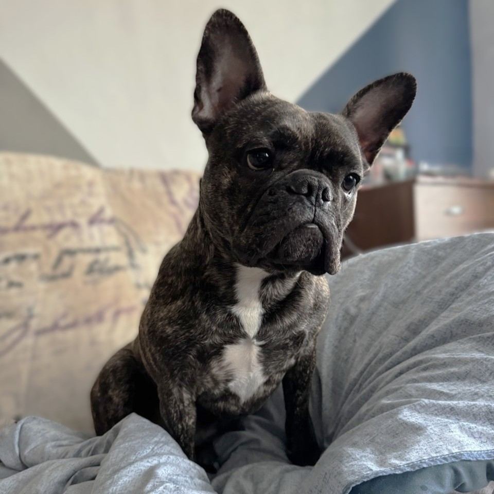

## Мой пёс - Майки🐾. Портфолио

**Кличка**: Майки  
**Возраст**: 3,5 года  
**Порода**: Французский бульдог  
**Характер**: Активный, дружелюбный, жизнерадостный

## Фото

## Характеристики
- **Энергия**: Майки — настоящий сгусток энергии! Он обожает активные игры и всегда готов к новым приключениям.  
- **Любимые занятия**:
  - Игры с мячиком и игрушками-пищалками.
  - Прогулки в парке, безать за птицами, грызть палки.
  - Обучение новым трюкам (но только за вкусняшку).
- **Любимая еда**: всё, что можно пожевать.
- **Особые навыки**:
  - Умеет выполнять команды "сидеть", "лежать", "прыжок" и "дай лапу" (но опять же, только за вкусняшки).
  - Мастер по поиску спрятанных игрушек.

## Интересные факты
Не любит оставаться один. Всегда будет там, где есть хоть один человек.  

Обожает все виды игрушек. Два года была любимая игрушка - крыса, которую в конце концов разгрыз вклочья. Зато сейчас при её упоминании пытается найти во всех углах квартиры.

Майки может бесконечно долго гулять, даже если уже нет сил передвигать лапы.
